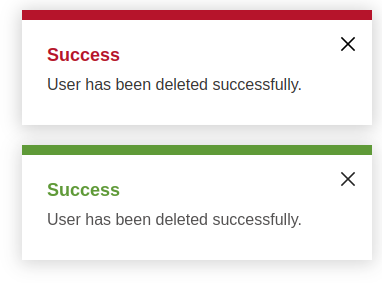

# Angular Simple Flash Message
Angular Flash Message is a lightweight package that provides a minimalist approach to displaying success and error messages in Angular applications. This package is designed to be simple and easy to use, allowing developers to quickly integrate Flash messages into their projects.



# Features
- Display success messages
- Display error messages
- Minimalist approach
- Lightweight

# Installation
You can install the Angular Flash Message package via npm by running the following command:

```
npm i simple-flash-message
```
Usage
Import the FlashMessageModule in your Angular module:

```
import { FlashModule } from "simple-flash-message"
@NgModule({
imports: [
FlashModule
],
// ...
})
export class AppModule { }
```

Use the flash directive in your component template to display messages:
```
<app-flash></app-flash>
```

Inject the FlashService into your component and use it to display flash messages:
```
import { FlashService } from "simple-flash-message";

@Component({
  // ...
})
export class YourComponent {
  constructor(private flashMessageService: FlashMessageService) { }

  showSuccessMessage() {
   this.flashService.showFlash(
      'success',
      "Success Title",
      "Success Message."
    );
  }

  showErrorMessage() {
     this.flashService.showFlash(
      'error',
      "Error Title",
      "Error Message."
    );
  }
}
````

